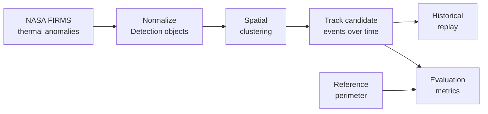

# WildfireWatch

WildfireWatch is a learning-first Python project for turning raw NASA FIRMS
active-fire detections into clean, tested candidate fire events.

> **Status:** v0.3.0 is complete with controlled evaluation metrics,
> threshold-sensitivity experiments, baseline versus one-to-one tracking,
> historical replay visualization, and spatial reference coverage for a
> bounded FIRMS dataset around Lahaina.

FIRMS detections are satellite-observed thermal anomalies. They are not
necessarily confirmed wildfires, and WildfireWatch is not an emergency,
safety, or authoritative fire-detection system.

## At a glance




Red points are cumulative FIRMS thermal-anomaly detections, blue crosses are
candidate-event centroids, and the green area is a reference perimeter. Each
panel uses only information available by its timestamp.

| Reproducible evidence | Measured result |
| --- | --- |
| Historical subset | 56 detections across 3 acquisition timestamps |
| Final replay comparison | baseline: 1 event; one-to-one: 2 events |
| Reference-perimeter coverage | 67.86% of detections inside or on the polygon |

These results describe this bounded experiment. They are not wildfire
confirmation, emergency guidance, or globally validated tracking accuracy.

## v0.0.0 scope

The current code can:

- read a small fixed NASA FIRMS VIIRS NOAA-20 NRT CSV sample;
- convert raw CSV strings into typed `Detection` objects;
- combine FIRMS acquisition date and time into timezone-aware UTC datetimes;
- preserve only the fields needed by the current domain model;
- return an empty list for an empty CSV file;
- fail visibly when required fields or valid values are missing;
- format detection count and acquisition-time range summaries;
- run the current ingestion pipeline from the command line;
- format Python source and test files consistently with Black;
- verify behavior with a small pytest suite.

This version does **not** include clustering, event tracking, historical
replay, databases, APIs, web maps, Earth Engine, priority scoring, machine
learning, or deployment.

## v0.1.0 scope

WildfireWatch now calculates the great-circle distance between two geographic
coordinates with the Haversine formula and a mean Earth radius of 6,371 km.
Tests cover identical points, one degree of longitude at the equator,
symmetry, and an approximate Rome-to-Milan distance.

The current clustering baseline compares every pair of detections and connects
pairs within a configurable distance threshold. Connected detections are
grouped transitively, so an A-B-C chain forms one candidate cluster even when A
and C exceed the threshold. The function preserves input order within its
output clusters. It is available as Python code but is not yet part of the
command-line pipeline.

Each non-empty cluster can be summarized as a typed `ClusterSummary` containing
its detection count and arithmetic-mean latitude/longitude centroid. Asking for
the summary of an empty cluster raises `ValueError`, because its centroid is
undefined.

## v0.2.0 scope

`ClusterSummary` now also records the earliest and latest acquisition times in
each cluster. A minimal `FireEvent` model records a stable integer ID, first and
last observation times, a centroid, and cumulative detection count. Its
`duration` property is calculated from the first and last observation times, so
the same information is not stored twice.
Clusters are associated with an existing event only when both the geographic
distance and elapsed-time thresholds are satisfied; otherwise, a new stable
event ID is created. When several events are compatible, the nearest one is
selected. Its cumulative centroid is updated with a detection-count-weighted
mean. Each event retains immutable observation snapshots containing the
cluster's time range, centroid, detection count, and total FRP. The cumulative
path between consecutive centroids can be calculated from that history. This
is an observation-based movement proxy, not proof of physical fire movement.
The difference between the last and first observed radii provides a simple net
spatial-growth proxy. All intermediate radii remain available in the history,
because the net value alone can hide expansion and contraction between them.

## Data flow

The command-line program currently runs the reproducible ingestion path:

```text
FIRMS CSV
    -> csv.DictReader
    -> one raw dictionary per row
    -> detection_from_row
    -> Detection objects
    -> human-readable summary
```

The Python library also supports the v0.2 processing path:

```text
Detection objects
    -> spatial clusters
    -> ClusterSummary objects
    -> spatiotemporal association
    -> FireEvent objects with observation history
    -> centroid-path and radius-change metrics
```

The v0.3 evaluation path is:

```text
controlled labels + clusters
    -> real v0.2 tracker assignments
    -> false-split, false-merge, reduction, and continuity metrics
    -> spatial/temporal threshold experiments
    -> measured JSON reports
```

The historical replay path is:

```text
saved historical FIRMS CSV
    -> detections grouped by acquisition timestamp
    -> clustering of only the new detections in each frame
    -> incremental event updates without future information
    -> immutable chronological frame snapshots
```

The spatial reference evaluation path is:

```text
historical FIRMS detections + local reference Polygon
    -> point-in-polygon checks
    -> inside-or-boundary detection coverage ratio
    -> measured JSON report with explicit limitations
```

See [evaluation and replay notes](docs/evaluation-and-replay.md) for the
methodology, commands, measured results, and limitations.

## Detection model

| Internal field | FIRMS source | Normalization |
| --- | --- | --- |
| `latitude` | `latitude` | string to `float` |
| `longitude` | `longitude` | string to `float` |
| `acquired_at_utc` | `acq_date` + `acq_time` | zero-pad `HHMM`, parse, attach UTC |
| `frp` | `frp` | string to `float` |
| `confidence` | `confidence` | retained as a string |
| `satellite` | `satellite` | retained as a string |
| `day_night` | `daynight` | renamed and retained as a string |

The raw sample retains all original source columns. The internal model keeps
only fields that have a concrete purpose in v0.0.0.

## Cluster summary model

| Field | Meaning |
| --- | --- |
| `detection_count` | number of detections in the cluster |
| `total_frp` | sum of detection FRP values in the cluster, in MW |
| `centroid_latitude` | arithmetic mean of detection latitudes |
| `centroid_longitude` | arithmetic mean of detection longitudes |
| `max_radius_km` | maximum distance from the centroid to a detection |
| `first_seen_utc` | earliest acquisition time in the cluster |
| `last_seen_utc` | latest acquisition time in the cluster |

## Requirements

- Python 3.11 or newer
- Git

The application uses `python-dotenv` to load the private FIRMS MAP_KEY from a
local `.env` file and Matplotlib to generate the static replay visualization.
`pytest` and Black are optional development dependencies used for tests and
code formatting.

## Setup

These commands target macOS and Linux shells:

```bash
python3 -m venv .venv
source .venv/bin/activate
python -m pip install -e ".[dev]"
```

The editable installation means changes to the local source code are used
without reinstalling the package after every edit.

## Run the current pipeline

Run the committed sample from the repository root:

```bash
python -m wildfirewatch data/raw/viirs_noaa20_nrt_sample.csv
```

Expected output for the committed sample:

```text
Detections: 5
First acquired (UTC): 2025-06-06T00:01:00+00:00
Last acquired (UTC): 2025-06-06T00:01:00+00:00
```

## Run the tests

With the virtual environment activated:

```bash
python -m pytest
```

## Run the v0.3 experiments

Regenerate the controlled synthetic threshold report:

```bash
python scripts/run_synthetic_evaluation.py
```

Regenerate the initial Lahaina historical replay:

```bash
python scripts/run_historical_replay.py \
  data/raw/viirs_noaa20_sp_lahaina_2023-08-08_2023-08-12.csv
```

Download the local reference perimeter and regenerate spatial coverage:

```bash
python scripts/download_reference_perimeter.py
python scripts/run_spatial_evaluation.py \
  data/raw/viirs_noaa20_sp_lahaina_2023-08-08_2023-08-12.csv
```

The measured coverage is 67.86% across 56 detections. It is a spatial
consistency measure against one reference perimeter, not an accuracy,
precision, or recall claim.

Generate the static one-to-one replay visualization:

```bash
python scripts/plot_historical_replay.py \
  data/raw/viirs_noaa20_sp_lahaina_2023-08-08_2023-08-12.csv
```

The panels contain 49, 53, and 56 cumulative detections. Each panel uses only
detections acquired by its timestamp, so the image demonstrates the replay's
no-future-data behavior as well as the final two-event one-to-one result.

The historical downloader reads `FIRMS_MAP_KEY` from a local `.env` file that
is ignored by Git. Copy `.env.example` to `.env`, replace the placeholder, and
never commit or share the resulting file.

The tests currently document:

- construction of the `Detection` data model;
- short and four-digit FIRMS acquisition times;
- invalid acquisition times;
- raw-row normalization;
- missing required fields;
- loading every row of the fixed sample;
- empty-file behavior;
- empty and non-empty summaries;
- the complete command-line pipeline and its output;
- geographic distance edge cases, known approximate distances, and symmetry;
- empty, singleton, nearby, distant, and transitively connected clustering
  cases;
- cluster count, centroid, temporal range, FRP, radius, and empty-cluster error
  behavior;
- event creation, compatible updates, stable IDs, spatial/temporal non-matches,
  nearest-event selection, and observation-free windows;
- event duration, observation history, centroid path, radius change, and empty
  history behavior.
- point-in-polygon behavior for internal, external, boundary, and invalid
  polygons, plus historical detection coverage calculations.

## Format the code

With the virtual environment activated, apply the project's formatting rules
to the application and tests:

```bash
python -m black wildfirewatch tests
```

To check formatting without changing any files:

```bash
python -m black --check wildfirewatch tests
```

Black formats Python source layout consistently. It does not replace tests,
which verify behavior, or a linter, which can identify certain code-quality
problems.

## Error behavior

| Input | Current behavior |
| --- | --- |
| Empty CSV file | returns an empty list |
| Invalid date, time, or numeric value | raises `ValueError` |
| Missing required dictionary field | raises `KeyError` |
| Missing file | raises `FileNotFoundError` |
| Empty cluster passed to `summarize_cluster` | raises `ValueError` |

Input and parsing errors are intentionally visible in these early versions.
Silently skipping malformed rows could hide data loss. More contextual error
messages may be introduced later without concealing the original failure.

## Data provenance

`data/raw/viirs_noaa20_nrt_sample.csv` is a fixed, manually curated five-row
subset displayed in NASA's official
[FIRMS API tutorial](https://firms.modaps.eosdis.nasa.gov/content/academy/data_api/firms_api_use.html).
It uses the `VIIRS_NOAA20_NRT` dataset and retains all 14 columns shown by the
tutorial. The fixed subset avoids requiring an API key during early learning
and keeps tests reproducible.

NASA describes the underlying NOAA-20 VIIRS product as a near-real-time active
fire detection product with a nominal 375 m resolution. See the
[NASA Earthdata product page](https://www.earthdata.nasa.gov/data/catalog/lancemodis-vj114img-nrt-2)
and [sample data notes](data/README.md).

The v0.3 work also includes a bounded `VIIRS_NOAA20_SP` historical CSV around
Lahaina for 8--12 August 2023. The saved subset contains 56 thermal-anomaly
detections in three acquisition timestamps. It supports chronological replay;
it is not labeled wildfire ground truth. Exact query parameters and the
reproducible download command are documented in
[evaluation and replay notes](docs/evaluation-and-replay.md).

The spatial evaluation downloads one public Lahaina reference polygon from a
feature service published in the USGS ArcGIS organization. The downloaded
GeoJSON is ignored by Git because the service item exposes no explicit
license; source metadata and the reproducible command are recorded in
[data notes](data/README.md).

## Project structure

```text
wildfirewatch/
├── wildfirewatch/
│   ├── clustering.py
│   ├── evaluation.py
│   ├── evaluation_scenarios.py
│   ├── event_metrics.py
│   ├── experiments.py
│   ├── geo.py
│   ├── ingestion.py
│   ├── models.py
│   ├── replay.py
│   ├── spatial_evaluation.py
│   ├── summary.py
│   └── tracking.py
├── tests/
├── scripts/
├── evaluation/results/
├── data/
│   ├── README.md
│   ├── raw/
│   └── reference/  (downloaded locally, ignored by Git)
├── docs/
├── README.md
├── roadmap.md
└── pyproject.toml
```

## Learning approach

WildfireWatch has two equal goals:

1. learn Python, testing, algorithms, and software engineering deeply;
2. become an honest, explainable portfolio project.

Core logic and tests are developed in small learning-focused steps. Mechanical
setup and documentation work may be automated, but important design and
algorithm decisions must remain understandable to the project owner.

See [roadmap.md](roadmap.md) for planned versions and project milestones.

## Current limitations

- The datasets remain small: one five-row ingestion sample and one bounded
  56-row historical replay subset from a single VIIRS source.
- NRT detections are not ground truth and may include non-wildfire thermal
  anomalies.
- The current model performs type conversion but does not yet validate
  coordinate ranges or normalize confidence/day-night codes.
- Geographic distances approximate Earth as a sphere with a mean radius; they
  are suitable for the current baseline, not survey-grade measurements.
- Clustering currently uses only spatial distance and ignores acquisition time,
  FRP, confidence, and satellite source.
- Transitive connections can create long chains whose endpoints are farther
  apart than the configured threshold.
- Comparing every pair of detections has quadratic time complexity and is not
  intended yet for large datasets.
- Arithmetic-mean latitude/longitude centroids are intended for small local
  clusters and do not handle poles or the antimeridian specially.
- Event association assumes observation windows are processed chronologically
  and uses fixed spatial and temporal thresholds rather than a validated
  probabilistic model.
- When several events are compatible, the nearest centroid wins; equal-distance
  ties retain the first event in input order.
- Events are retained unchanged during empty observation windows; v0.2.0 does
  not assign active/inactive status or prune old event history.
- Centroid path and radius change describe changes in satellite observations;
  they are not validated measurements of physical fire spread or burned area.
- The main `python -m wildfirewatch` command still exposes only ingestion;
  evaluation and replay currently use dedicated scripts.
- Synthetic labels verify controlled behavior but are not validation against
  confirmed wildfire perimeters.
- The historical replay uses exploratory thresholds. In its third frame the
  baseline associates two spatial clusters with one event, while the
  one-to-one alternative produces two events; neither result alone proves the
  number of real wildfires.
- The measured 67.86% reference-perimeter coverage is not tracking accuracy.
  One perimeter cannot validate predicted event identities or temporal
  associations, and boundary/reference uncertainty is not modeled.
- The replay visualization is a static evaluation artifact, not a live map or
  emergency-monitoring interface.
