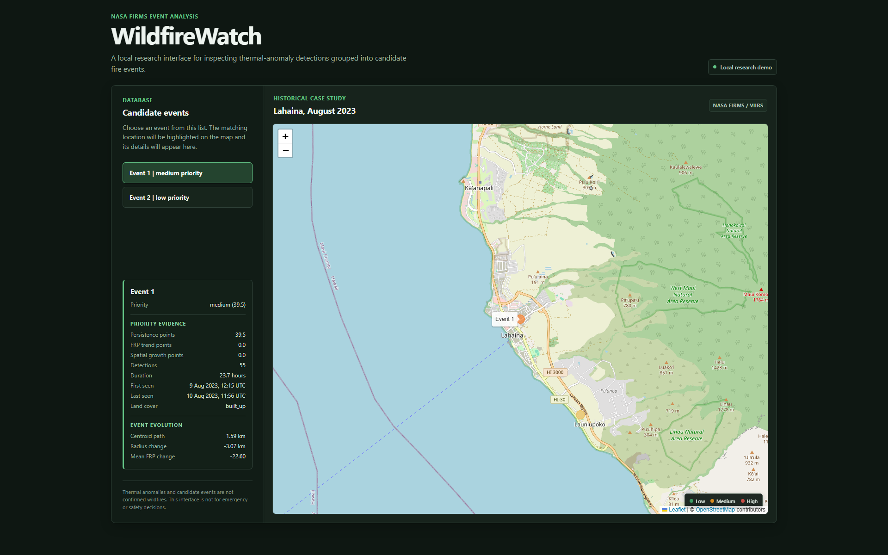
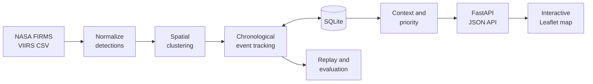

# WildfireWatch

[](https://github.com/stoppo22/wildfirewatch/actions/workflows/ci.yml)

WildfireWatch turns NASA FIRMS satellite thermal-anomaly detections into
persistent candidate fire events that can be inspected through a tested API
and an interactive map.

> **Current version:** v1.0.0. The processing pipeline, evaluation artifacts,
> local API, interactive map, and reproducible demo are release-ready.

FIRMS detections are not confirmed wildfires. WildfireWatch is a research
prototype, not an emergency, safety, or authoritative detection system.



*The local explorer shows candidate events around Lahaina and explainable
metrics for the selected event. Colored circular markers are WildfireWatch
candidate events; other symbols belong to the OpenStreetMap base map. Review
priority is heuristic and is not emergency risk.*

## What it does

WildfireWatch builds an inspectable processing path from individual satellite
observations to candidate events:

1. normalizes selected NASA FIRMS VIIRS fields into typed detections;
2. groups nearby detections into spatial clusters;
3. associates chronological clusters into persistent candidate events;
4. stores detections, events, and observation history in SQLite;
5. reconstructs historical event evolution without using future detections;
6. evaluates controlled tracking behavior and spatial consistency;
7. optionally adds ESA WorldCover land-cover context;
8. calculates an explainable review-priority score;
9. serves event summaries and details through FastAPI and an interactive map.

The priority score combines persistence, mean-FRP trend, and spatial-growth
signals. It is a transparent ranking heuristic, not a probability, fire
classification, danger score, or spread prediction.

## Measured historical case study

The committed Lahaina subset provides a small reproducible case study:

| Evidence | Measured result |
| --- | --- |
| Historical subset | 56 VIIRS detections across 3 acquisition timestamps |
| Baseline tracking | 1 final candidate event |
| One-to-one tracking | 2 final candidate events |
| Reference-perimeter coverage | 67.86% of detections inside or on the polygon |
| Priority sensitivity | Event 1 ranked first in all 6 tested configurations |
| Cold local pipeline benchmark | 28.57 ms median across 15 fresh SQLite runs |

These results describe one bounded experiment. The 67.86% value is a spatial
consistency measurement, not tracking accuracy, precision, or recall. The
available reference polygon does not provide event identities or temporal
ground truth.

The runtime is a wall-clock measurement on the development machine, not a
cross-hardware performance comparison. The reproducible benchmark script is
[`scripts/run_pipeline_benchmark.py`](scripts/run_pipeline_benchmark.py).


*Red points are cumulative FIRMS thermal anomalies, blue crosses are candidate
event centroids, and the green area is a reference perimeter. Each panel uses
only detections available by its timestamp.*

## Quick start

With Python 3.11+ and an activated virtual environment:

```bash
python -m pip install -e ".[dev]"
python -m scripts.run_incremental_processing \
  data/raw/viirs_noaa20_sp_lahaina_2023-08-08_2023-08-12.csv \
  --database data/wildfirewatch.db
python -m uvicorn wildfirewatch.api:app --reload
```

Open `http://127.0.0.1:8000`.

This demo needs no API key. Land-cover values remain `Unknown` until the
optional Earth Engine enrichment is run.

## Architecture



The frontend does not duplicate scientific or scoring logic. The backend
calculates event metrics and priority classifications; JavaScript requests the
resulting JSON and formats it for display.

## API

| Method and path | Behavior |
| --- | --- |
| `GET /` | open the local interactive event explorer |
| `GET /api/events` | list persisted candidate-event summaries |
| `GET /api/events/{event_id}` | return metrics, context, priority, and observation history for one event |
| `GET /docs` | open FastAPI's generated API documentation |

## Reproduce the evidence

Run the test suite:

```bash
python -m pytest
```

Regenerate the historical replay report:

```bash
python -m scripts.run_historical_replay \
  data/raw/viirs_noaa20_sp_lahaina_2023-08-08_2023-08-12.csv
```

See the [evaluation and replay notes](docs/evaluation-and-replay.md) for
all experiment, visualization, and reference-data commands. GitHub Actions
runs the tests and `black --check` on every push and pull request.

## Optional external data

The demo and tests need no secrets. `FIRMS_MAP_KEY` is required only to download
new FIRMS data; Earth Engine authentication is required only for WorldCover
context. Setup is documented in `.env.example` and the
[environmental-context notes](docs/environmental-context.md).

## Current limitations

- The evaluation uses one small, geographically bounded subset from one VIIRS
  source, whose thermal anomalies may include non-wildfire heat sources.
- The reference perimeter does not provide temporal or event-identity ground
  truth, so it cannot establish tracking accuracy.
- Clustering, event association, and priority scoring use exploratory heuristics
  rather than validated predictive models.
- WorldCover context samples one 2021 raster pixel at an event centroid and may
  not represent the full event area.
- Pairwise clustering is quadratic, and SQLite persistence is intended for
  small, local, single-process workloads.
- The web application is a local research demo, not a live monitoring service.

## Technical documentation

- [Evaluation and historical replay](docs/evaluation-and-replay.md)
- [Persistence and incremental processing](docs/persistence-and-incremental-processing.md)
- [Environmental context](docs/environmental-context.md)
- [Priority scoring](docs/priority-scoring.md)
- [Data sources and provenance](data/README.md)
- [Development roadmap](roadmap.md)

Released under the [MIT License](LICENSE).
