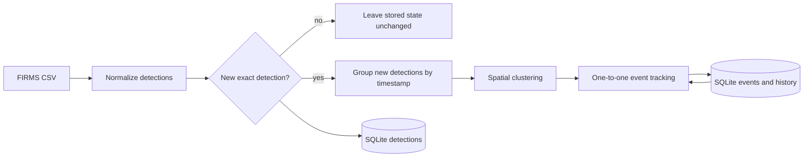

# Persistence and incremental processing

This document describes the completed v0.4 SQLite work. FIRMS rows
remain satellite-observed thermal anomalies, and stored `FireEvent` objects
remain candidate events rather than confirmed wildfires.

## Incremental data flow



The pipeline stores each normalized detection before processing and keeps only
the detections that SQLite reports as newly inserted. It then loads existing
events, processes new detections in chronological frames, applies the
one-to-one tracker, and writes the updated event state back to SQLite.

## SQLite schema

The local database contains three tables:

- `detections` stores normalized FIRMS fields. A composite unique constraint
  makes repeated ingestion of the same normalized detection idempotent.
- `fire_events` stores the current summary of each candidate event. Its
  `event_id` primary key is updated with an UPSERT rather than duplicated.
- `event_observations` stores ordered history rows. The composite primary key
  `(event_id, observation_index)` preserves one position per event history,
  and a foreign key describes its relationship to `fire_events`.

Event observations are replaced inside the same transaction whenever an event
is saved. This keeps the stored history equal to the current Python
`FireEvent.observations` list and makes repeated event UPSERTs idempotent.

## Run the command

From the repository root with the virtual environment activated:

```bash
python -m scripts.run_incremental_processing \
  data/raw/viirs_noaa20_nrt_sample.csv \
  --database data/wildfirewatch.db
```

Optional thresholds:

```text
--cluster-distance-km 2.0
--event-distance-km 10.0
--max-time-gap-hours 13.0
```

The command logs `received`, `new`, `events`, and the resolved database path.
Running an identical input again should report `new=0` and must not increase
the stored event detection count.

## Transaction behavior

The command opens one SQLite connection for the complete operation. Successful
processing commits detections, event summaries, and event observations
together. Any exception triggers a rollback, logs the failure, closes the
connection, and leaves the error visible to the caller.

Library functions do not call `commit()` themselves. This keeps transaction
ownership at the application boundary and allows callers to combine several
database operations atomically.

## Restart behavior

Tests write an event and its observation history to a real temporary database,
close the connection, reopen the file, and reconstruct equivalent Python
objects. A separate integration test processes one detection, reopens the
database, and confirms that a later compatible detection updates the same
event ID and appends a second observation.

## Current limitations

- Exact duplicate detection uses all normalized detection fields. Near-equal
  records are not treated as duplicates.
- Incremental processing assumes newly encountered observations arrive in
  chronological order. A previously unseen late observation may not associate
  with an event whose stored `last_seen_utc` is later.
- Event loading currently performs one additional observation query per event.
  This is intentionally simple and can be replaced by grouped bulk loading if
  measurements show it matters.
- SQLite persistence is local and single-process oriented; concurrent writers
  and database migrations are not yet handled.
